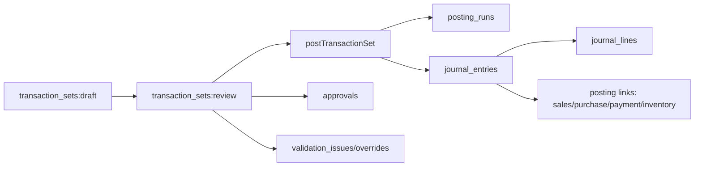
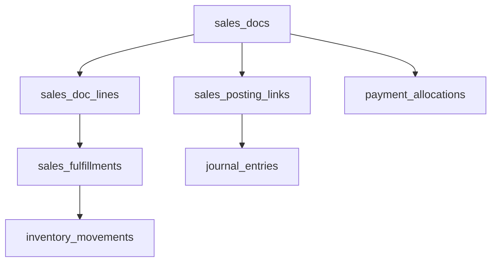
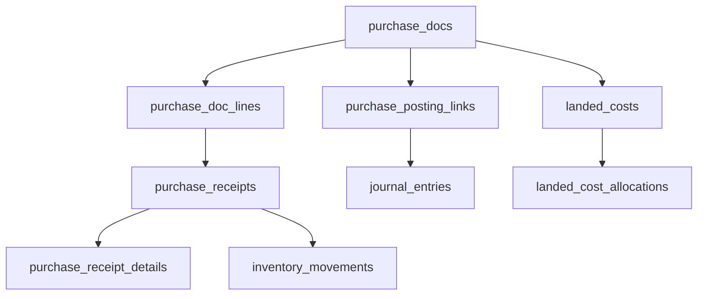
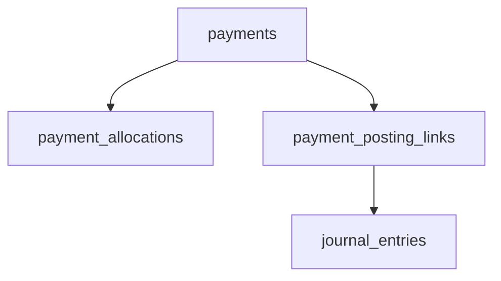
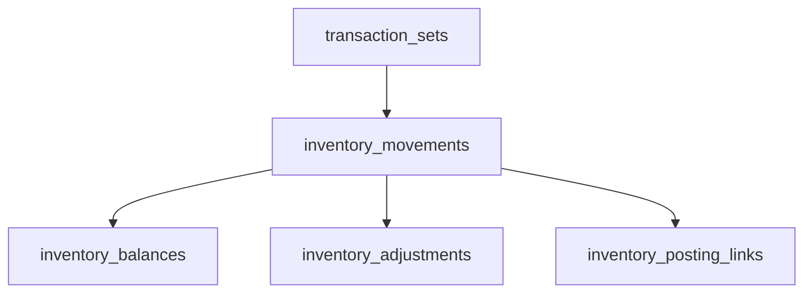
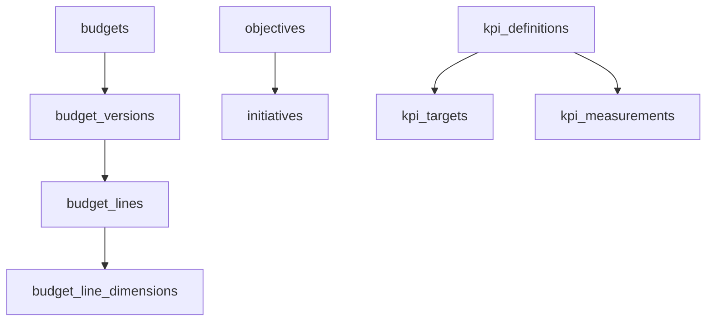
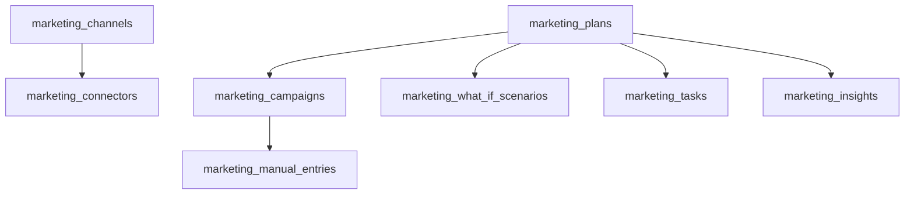
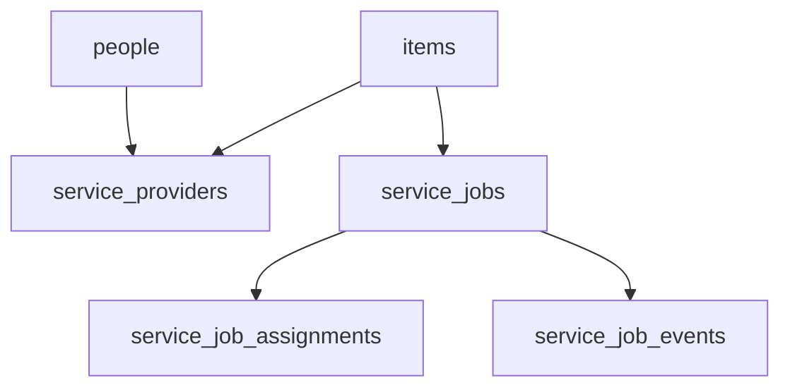
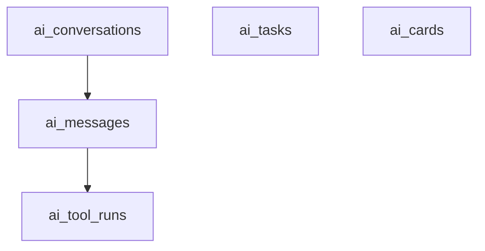
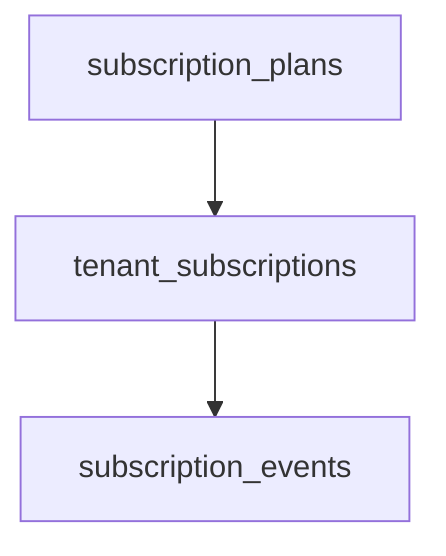

# UDP Project Workflow Map (Claude-Readable)

This file provides a visual and structural overview of the UDP codebase: database tables, core workflows, API routes, UI pages, and known overlaps/redundancies.

## Scope

- Codebase root: `/Users/alan/Desktop/udp`
- Database schema: `src/db/schema.ts`
- API routes: `src/app/api/**/route.ts`
- UI pages: `src/app/**/page.tsx`
- Core posting logic: `src/lib/posting.ts`

## Tech Stack

- Frontend: Next.js 16 (App Router), React 19, TypeScript
- Styling: Tailwind CSS v4 (via PostCSS)
- Backend: Next.js route handlers (Node.js)
- Database: PostgreSQL
- ORM/Migrations: Drizzle ORM + drizzle-kit
- Auth: JWT/session via `jose`
- Payments: Stripe

## System Topology (High-Level)

```mermaid
graph TD
  Tenant[tenants] --> Users[users]
  Tenant --> Roles[roles]
  Users --> UserRoles[user_roles]
  Users --> Actors[actors]
  Tenant --> Settings[tenant_settings]
  Tenant --> Legal[tenant_legal_profiles]
  Tenant --> Depts[departments]
  Users --> Profiles[user_profiles]
  Tenant --> Audit[audit_events]
  Tenant --> Docs[documents]
  Docs --> DocLinks[document_links]

  subgraph CorePosting[Core Posting Pipeline]
    TxSet[transaction_sets] --> BizTx[business_transactions]
    BizTx --> BizLines[business_transaction_lines]
    TxSet --> Intents[posting_intents]
    TxSet --> Runs[posting_runs]
    Runs --> JE[journal_entries]
    JE --> JL[journal_lines]
    JE --> Reversal[reversal_links]
  end

  subgraph MasterData
    Parties[parties] --> PartyProfiles[party_profiles]
    Parties --> PartyIds[party_identifiers]
    COA[chart_of_accounts] --> Accounts[accounts]
    DimDef[dimension_definitions] --> DimVals[dimension_values]
    DimVals --> EntDims[entity_dimensions]
    UOM[uoms]
    Tax[tax_categories]
    Products[products]
    Warehouses[warehouses] --> Locations[storage_locations]
    Categories[categories]
    Items[items]
    Items --> ItemIds[item_identifiers]
  end

  subgraph Inventory
    InvMove[inventory_movements] --> InvBal[inventory_balances]
    InvMove --> InvPostLinks[inventory_posting_links]
    InvMove --> InvAdj[inventory_adjustments]
  end

  subgraph SalesProcurement
    SalesDocs[sales_docs] --> SalesLines[sales_doc_lines]
    PurchaseDocs[purchase_docs] --> PurchaseLines[purchase_doc_lines]
    SalesDocs --> SalesPost[sales_posting_links]
    PurchaseDocs --> PurchasePost[purchase_posting_links]
    SalesLines --> SalesFulfill[sales_fulfillments]
    PurchaseLines --> PurchaseReceipts[purchase_receipts]
    PurchaseReceipts --> PurchaseReceiptDetails[purchase_receipt_details]
  end

  subgraph Payments
    Payments[payments] --> Alloc[payment_allocations]
    Payments --> PayPost[payment_posting_links]
  end

  subgraph Strategy
    Budgets[budgets] --> BudgetVersions[budget_versions] --> BudgetLines[budget_lines]
    BudgetLines --> BudgetDims[budget_line_dimensions]
    Objectives[objectives] --> Initiatives[initiatives]
    KpiDefs[kpi_definitions] --> KpiTargets[kpi_targets]
    KpiDefs --> KpiMeasures[kpi_measurements]
  end

  subgraph Marketing
    MktChannels[marketing_channels] --> MktConnectors[marketing_connectors]
    MktPlans[marketing_plans] --> MktCampaigns[marketing_campaigns]
    MktPlans --> MktScenarios[marketing_what_if_scenarios]
    MktPlans --> MktTasks[marketing_tasks]
    MktInsights[marketing_insights]
    MktCards[marketing_analytics_cards]
  end

  subgraph PeopleServices
    People[people] --> ServiceProviders[service_providers]
    Items --> ServiceJobs[service_jobs] --> ServiceAssign[service_job_assignments]
    ServiceJobs --> ServiceEvents[service_job_events]
  end

  subgraph AI
    AIConv[ai_conversations] --> AIMsg[ai_messages] --> AIToolRuns[ai_tool_runs]
    AITasks[ai_tasks]
    AICards[ai_cards]
  end

  subgraph Subscriptions
    Plans[subscription_plans] --> TenantSubs[tenant_subscriptions] --> SubEvents[subscription_events]
  end
```

## Core Workflows (End-to-End)

### 1) Omni Transaction -> Posting -> Ledger



Key logic lives in `src/lib/posting.ts` (only writer for `journal_entries` and `journal_lines`).

Workflow behavior:
- Draft transaction set is created by Omni or a module-specific API.
- Submission moves status to `review` and creates `posting_intents`.
- Posting validates approvals and validation issues, creates `posting_runs`, and writes ledger entries.
- Posting links connect journal entries back to the source module (sales/purchase/payment/inventory).

### 2) Sales Flow (Quote/Order/Invoice -> Fulfillment -> Posting)



Related UI: `/sales`, `/sales/[id]`, `/sales/pipeline`, `/sales-customers`
Related APIs: `/api/sales/docs`, `/api/sales/docs/[id]/lines`, `/api/sales/docs/[id]/fulfill`, `/api/sales/docs/[id]/post`

Workflow behavior:
- Sales document and lines are created/edited via API and UI.
- Fulfillment creates inventory movements and updates fulfillment links.
- Posting creates ledger entries and writes `sales_posting_links`.

### 3) Procurement Flow (RFQ/Order/Invoice -> Receiving -> Posting)



Related UI: `/procurement`, `/procurement/[id]`
Related APIs: `/api/procurement/docs`, `/api/procurement/docs/[id]`, `/api/procurement/docs/[id]/receive`, `/api/procurement/docs/[id]/post`

Workflow behavior:
- Purchase document and lines are created/edited via API and UI.
- Receiving creates inventory movements and receipt details.
- Posting creates ledger entries and writes `purchase_posting_links`.

### 4) Payments (AR/AP)



Related UI: `/finance/payments`, `/finance/payments/[id]`, `/finance/ar`, `/finance/ap`
Related APIs: `/api/finance/payments`, `/api/finance/payments/[id]/post`, `/api/finance/payments/[id]/allocations`

Workflow behavior:
- Payment draft created, allocations recorded against sales/purchase docs.
- Posting writes journal entries and `payment_posting_links`.

### 5) Inventory (Movements -> Balances)



Related UI: `/inventory/balances`, `/operations/fulfillment`
Related APIs: `/api/omni/inventory/draft`, `/api/omni/inventory/post`, `/api/reports/inventory/balances`

Workflow behavior:
- Inventory movements are drafted or posted via Omni endpoints.
- Balances are derived from movements; posting links tie movements to ledger entries.

### 6) Strategy & Planning (Budgets, KPIs)



Related UI: `/strategy`, `/strategy/initiatives`
Related APIs: `/api/strategy/budgets`, `/api/strategy/objectives`, `/api/strategy/initiatives`, `/api/strategy/kpis`

Workflow behavior:
- Budgets are versioned; lines and dimensions are attached to versions.
- KPIs track targets and measurements linked to objectives/initiatives.

### 7) Marketing (Plan -> Campaign -> Tasks/Insights)



Related UI: `/marketing`
Related APIs: `/api/marketing/*`

Workflow behavior:
- Plans capture input snapshots and AI recommendations.
- Campaigns and tasks are created from plans; insights highlight performance.

### 8) People + Items + Service Jobs



Related UI: `/items`, `/people`, `/operations/services`
Related APIs: `/api/master/items`, `/api/people`, `/api/operations/service-jobs`

Workflow behavior:
- Items/people are maintained in master data and used across sales/procurement.
- Service jobs are created for service items sold, with assignments and events tracked.

### 9) AI Copilot (Conversations + Tasks)



Related UI: AI sidebar components in `src/components/ai/*`
Related APIs: `/api/ai/*`, `/api/ai-tasks/*`

Workflow behavior:
- Conversations store messages and tool runs.
- AI tasks are created for confirmations and human review.

### 10) Subscriptions + Billing



Related UI: `/billing`, `/settings/billing`
Related APIs: `/api/billing/*`, `/api/admin/tenant/subscription`

Workflow behavior:
- Plan selection creates or updates tenant subscriptions.
- Stripe events are stored as subscription events.

## UI Pages (App Router)

Public:
- `/` `src/app/page.tsx`
- `/login` `src/app/login/page.tsx`
- `/signup` `src/app/signup/page.tsx`
- `/onboarding` `src/app/onboarding/page.tsx`
- `/billing` `src/app/billing/page.tsx`

Authenticated (grouped under `src/app/(app)`):
- `/dashboard` `src/app/(app)/dashboard/page.tsx`
- `/dashboard/cards` `src/app/(app)/dashboard/cards/page.tsx`
- `/sales` `src/app/(app)/sales/page.tsx`
- `/sales/[id]` `src/app/(app)/sales/[id]/page.tsx`
- `/sales/pipeline` `src/app/(app)/sales/pipeline/page.tsx`
- `/sales-customers` `src/app/(app)/sales-customers/page.tsx`
- `/customers` `src/app/(app)/customers/page.tsx`
- `/customers/accounts` `src/app/(app)/customers/accounts/page.tsx`
- `/procurement` `src/app/(app)/procurement/page.tsx`
- `/procurement/[id]` `src/app/(app)/procurement/[id]/page.tsx`
- `/inventory/balances` `src/app/(app)/inventory/balances/page.tsx`
- `/items` `src/app/(app)/items/page.tsx`
- `/master/parties` `src/app/(app)/master/parties/page.tsx`
- `/master/products` `src/app/(app)/master/products/page.tsx`
- `/company` `src/app/(app)/company/page.tsx`
- `/company/organization` `src/app/(app)/company/organization/page.tsx`
- `/company/master` `src/app/(app)/company/master/page.tsx`
- `/company/master/categories` `src/app/(app)/company/master/categories/page.tsx`
- `/people` `src/app/(app)/people/page.tsx`
- `/operations` `src/app/(app)/operations/page.tsx`
- `/operations/fulfillment` `src/app/(app)/operations/fulfillment/page.tsx`
- `/operations/services` `src/app/(app)/operations/services/page.tsx`
- `/finance/ar` `src/app/(app)/finance/ar/page.tsx`
- `/finance/ar-aging` `src/app/(app)/finance/ar-aging/page.tsx`
- `/finance/ap` `src/app/(app)/finance/ap/page.tsx`
- `/finance/payments` `src/app/(app)/finance/payments/page.tsx`
- `/finance/payments/[id]` `src/app/(app)/finance/payments/[id]/page.tsx`
- `/finance/general-ledger` `src/app/(app)/finance/general-ledger/page.tsx`
- `/finance/trial-balance` `src/app/(app)/finance/trial-balance/page.tsx`
- `/finance/cash-position` `src/app/(app)/finance/cash-position/page.tsx`
- `/strategy` `src/app/(app)/strategy/page.tsx`
- `/strategy/initiatives` `src/app/(app)/strategy/initiatives/page.tsx`
- `/marketing` `src/app/(app)/marketing/page.tsx`
- `/grc` `src/app/(app)/grc/page.tsx`
- `/grc/audit` `src/app/(app)/grc/audit/page.tsx`
- `/grc/alerts` `src/app/(app)/grc/alerts/page.tsx`
- `/admin/users` `src/app/(app)/admin/users/page.tsx`
- `/settings` `src/app/(app)/settings/page.tsx`
- `/settings/users` `src/app/(app)/settings/users/page.tsx`
- `/settings/tenant` `src/app/(app)/settings/tenant/page.tsx`
- `/settings/billing` `src/app/(app)/settings/billing/page.tsx`

## API Routes (App Router)

Auth:
- `/api/auth/login`, `/api/auth/logout`, `/api/auth/me`, `/api/auth/signup`, `/api/auth/bootstrap`

Admin:
- `/api/admin/users`, `/api/admin/users/[id]`
- `/api/admin/tenant`, `/api/admin/tenant/subscription`

Sales:
- `/api/sales/docs`, `/api/sales/docs/[id]`
- `/api/sales/docs/[id]/lines`, `/api/sales/docs/[id]/fulfill`, `/api/sales/docs/[id]/fulfillments`
- `/api/sales/docs/[id]/post`

Procurement:
- `/api/procurement/docs`, `/api/procurement/docs/[id]`
- `/api/procurement/docs/[id]/lines`, `/api/procurement/docs/[id]/receive`, `/api/procurement/docs/[id]/receipts`
- `/api/procurement/docs/[id]/post`

Finance:
- `/api/finance/payments`, `/api/finance/payments/[id]`
- `/api/finance/payments/[id]/post`, `/api/finance/payments/[id]/void`
- `/api/finance/payments/[id]/allocations`, `/api/finance/payments/[id]/unallocate`
- `/api/finance/ar/open`, `/api/finance/ar/aging`, `/api/finance/ar/statement`
- `/api/finance/ap/open`, `/api/finance/ap/statement`

Reports:
- `/api/reports/dashboard`, `/api/reports/general-ledger`, `/api/reports/trial-balance`
- `/api/reports/finance/cash-position`, `/api/reports/finance/cashbook`
- `/api/reports/inventory/balances`

Master Data:
- `/api/master/parties`, `/api/master/parties/[id]`
- `/api/master/products`, `/api/master/products/[id]`
- `/api/master/items`, `/api/master/items/[id]`
- `/api/master/categories`, `/api/master/categories/[id]`
- `/api/master/dimensions`, `/api/master/dimensions/[definitionId]/values`
- `/api/master/entity-dimensions`
- `/api/master/warehouses`, `/api/master/warehouses/[id]`, `/api/master/warehouses/[id]/locations`

Company & People:
- `/api/company/org`, `/api/company/legal`
- `/api/company/departments`, `/api/company/departments/[id]`
- `/api/company/users/[id]/profile`
- `/api/people`, `/api/people/[id]`

Omni:
- `/api/omni/draft`, `/api/omni/submit`, `/api/omni/post`, `/api/omni/reverse`
- `/api/omni/inventory/draft`, `/api/omni/inventory/post`

Marketing:
- `/api/marketing/overview`
- `/api/marketing/channels`, `/api/marketing/channels/[id]`
- `/api/marketing/channels/oauth/[provider]/connect`, `/api/marketing/channels/oauth/[provider]/callback`
- `/api/marketing/plans`, `/api/marketing/plans/[id]`, `/api/marketing/plans/[id]/generate`, `/api/marketing/plans/[id]/scenarios`
- `/api/marketing/campaigns`, `/api/marketing/campaigns/[id]`
- `/api/marketing/tasks`, `/api/marketing/tasks/[id]`

Strategy:
- `/api/strategy/budgets`, `/api/strategy/budgets/[id]`, `/api/strategy/budgets/[id]/lines`
- `/api/strategy/objectives`, `/api/strategy/objectives/[id]`
- `/api/strategy/initiatives`, `/api/strategy/initiatives/[id]`
- `/api/strategy/kpis`, `/api/strategy/kpis/[id]`, `/api/strategy/kpis/[id]/targets`, `/api/strategy/kpis/[id]/measurements`

GRC & Planner:
- `/api/grc/alerts`
- `/api/planner/initiatives`, `/api/planner/initiatives/[id]`
- `/api/planner/alerts/[alertId]/dismiss`, `/api/planner/alerts/dismissed`

AI:
- `/api/ai/omni`, `/api/ai/confirm`, `/api/ai/cards`
- `/api/ai/conversations`, `/api/ai/conversations/[id]/messages`
- `/api/ai-tasks`, `/api/ai-tasks/[id]`

Billing:
- `/api/billing/plans`, `/api/billing/status`, `/api/billing/checkout`, `/api/billing/portal`, `/api/billing/webhook`

Settings:
- `/api/settings/finance`, `/api/settings/oauth`

## Redundancies / Overlaps (Potential Consolidation Targets)

- `products` vs `items`: both represent sellable/purchasable things; `items` is the unified catalog and overlaps `products` in price, tax, UOM, and vendor fields.
- `party` vs `people` vs `salespersons` vs `users`: multiple entity types represent actors/contacts; risks duplication of names, emails, and assignments.
- `tasks` vs `marketing_tasks` vs `ai_tasks`: three task systems with overlapping status/priority/assignment; consider harmonizing or mapping.
- `alerts` vs `marketing_insights`: both signal issues/actions; duplicates possible in UI and notification flows.
- `products` + `items` + `service_jobs`: service fulfillment references `items`, while sales/procurement reference `products` and `items` separately.
- `sales_docs`/`purchase_docs` vs `business_transactions`/`business_transaction_lines`: two document/transaction abstractions exist; risk for divergent reporting.

## Known Guardrails

- `src/lib/posting.ts` is the only writer to `journal_entries` and `journal_lines`.
- Tenant scoping is enforced at session/middleware level; tenant ID should not be trusted from request headers.

## Suggested Update Workflow (for structural changes)

1. Identify affected domain(s) in the diagrams above.
2. Trace the flow: DB tables -> API routes -> UI pages -> components.
3. Check if changes touch the posting pipeline or any `*_posting_links` tables.
4. Check redundancy list to avoid adding a third overlapping model.
