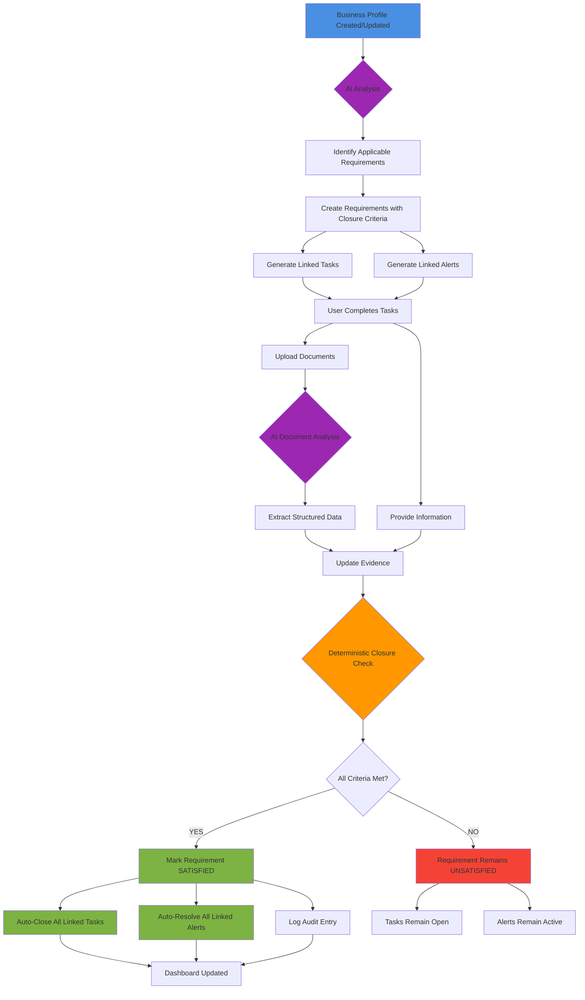
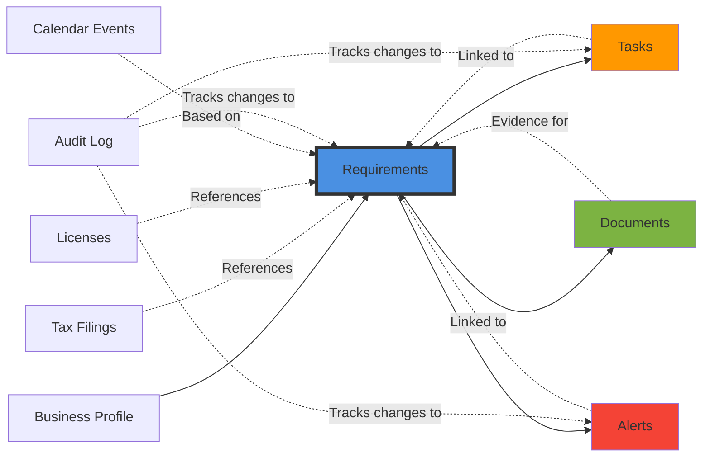
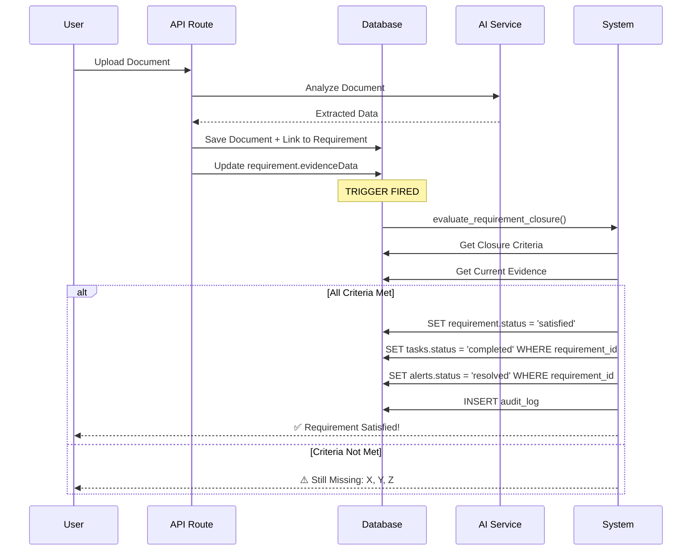
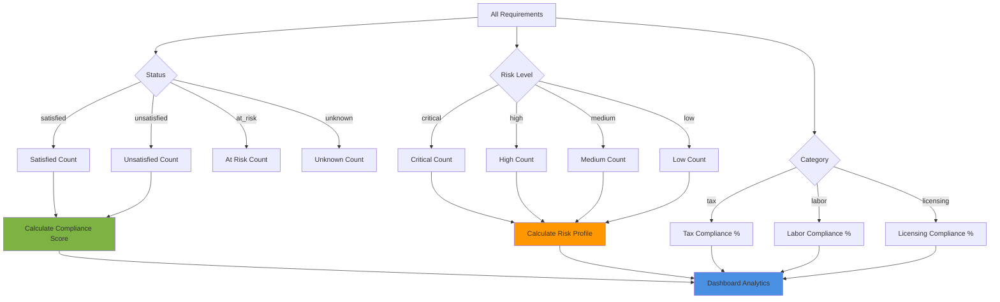
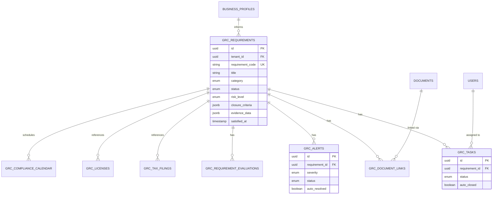
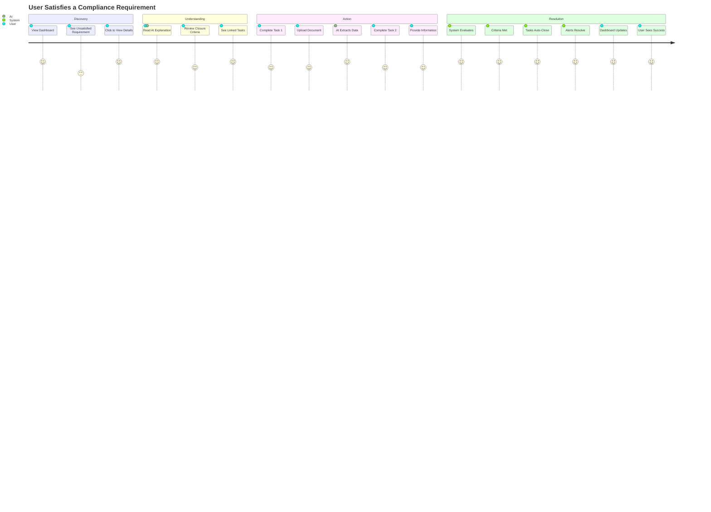
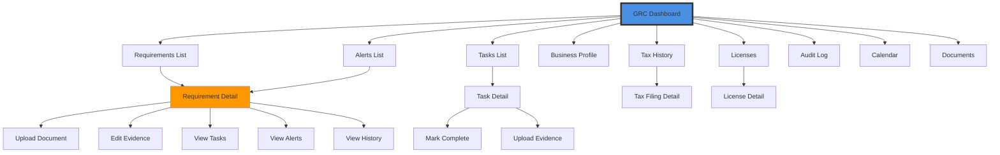
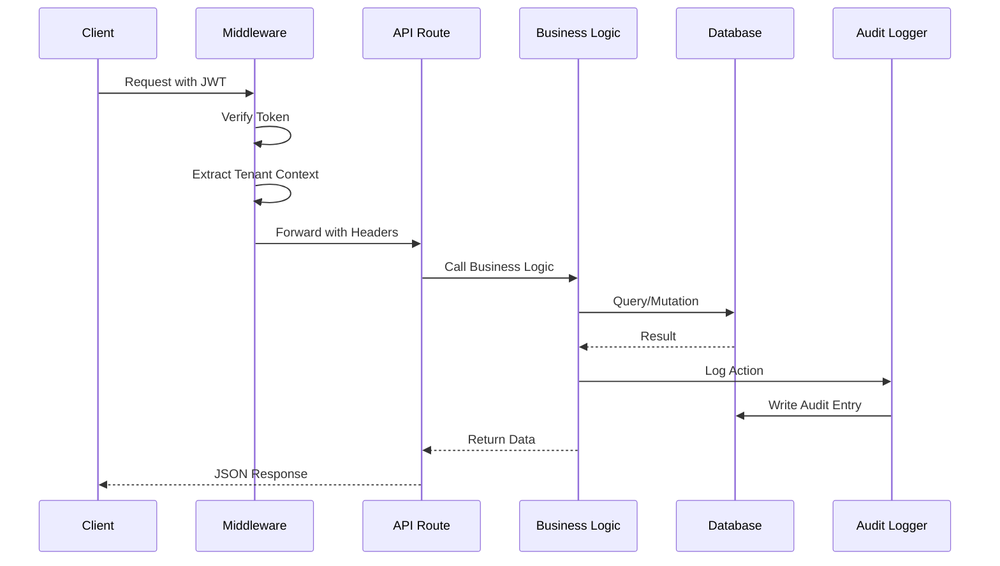

# GRC System Architecture

## Component Relationships

## Closure Logic Flow

## Analytics Calculation

## Database Relationships

## User Journey - New Requirement

## Page Navigation Flow

## API Request Flow

